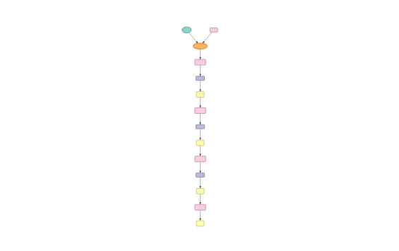
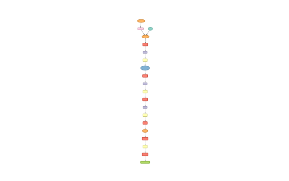
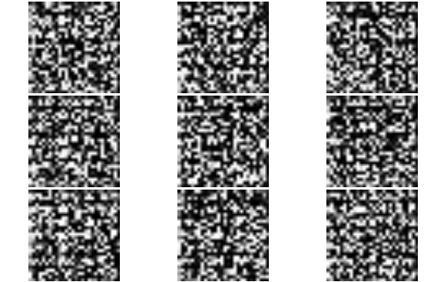
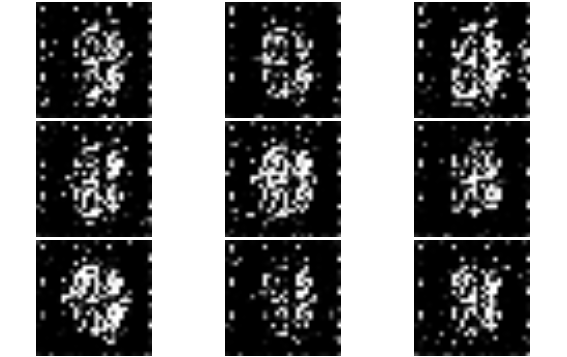
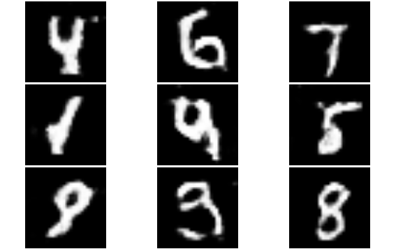

> Demo on how to build and train DCGAN model with MXNet and its R frontend.  

The demo involves running the two following scripts: 

- `DCGAN_mnist_setup`
- `DCGAN_train`

It also requires to have MNIST dataset (available through [Kaggle](https://www.kaggle.com/c/digit-recognizer/data)) in `/data/` folder. 

*** 

A Generative Adversial Model trains simultaneously two models: a generator that learns to output fake samples from an unknown distribution and another that learn that distinguish fake from real samples. 


Image credit: [Scott Reed](https://github.com/reedscot/icml2016)

## Generator 

Network that build target objects (MNIST images) from 2 components:  
- Noise vector  
- The labels defining the object condition (which digit to produce)


```{r, message=FALSE}
require(imager)
require(dplyr)
require(DT)
require(mxnet)
```

```{r, echo=FALSE}

D_sym<- mx.symbol.load(file.name = "models/D_sym_model_A1.json")
G_sym<- mx.symbol.load(file.name = "models/G_sym_model_A1.json")

```



## Discriminator

A model that attempt to distinguish a real sample from a fake one produced by the generator model. 



## Training process

The training process of the discriminator is most obvious: the loss is simple a binary TRUE/FALSE response and that loss is propagated back into the CNN network. It can therefore be understood as simple a binary classification problem. 

```{r, eval=F}
### Train loop on fake
mx.exec.update.arg.arrays(exec_D, arg.arrays = list(data=D_data_fake, digit=D_digit_fake, label=mx.nd.array(rep(0, batch_size))), match.name=TRUE)
mx.exec.forward(exec_D, is.train=T)
mx.exec.backward(exec_D)
update_args_D<- updater_D(weight = exec_D$ref.arg.arrays, grad = exec_D$ref.grad.arrays)
mx.exec.update.arg.arrays(exec_D, update_args_D, skip.null=TRUE)

### Train loop on real
mx.exec.update.arg.arrays(exec_D, arg.arrays = list(data=D_data_real, digit=D_digit_real, label=mx.nd.array(rep(1, batch_size))), match.name=TRUE)
mx.exec.forward(exec_D, is.train=T)
mx.exec.backward(exec_D)
update_args_D<- updater_D(weight = exec_D$ref.arg.arrays, grad = exec_D$ref.grad.arrays)
mx.exec.update.arg.arrays(exec_D, update_args_D, skip.null=TRUE)
```

The generator loss come from the backprogation of the the discriminator loss into it's generated output. By faking the generator labels to be real samples into the discriminator, the discriminator back-propagated loss provides the generator with the information on how to best adapt its parameters to trick the discriminator into believing the fake samples are real. 

This requires to backpropagate the gradients up to the input data of the discriminator (whereas this input gradient is typically ignored in vanilla feedforward network). 

```{r, eval=F}
### Update Generator weights - use a seperate executor for writing data gradients
exec_D_back<- mxnet:::mx.symbol.bind(symbol = D_sym, arg.arrays = exec_D$arg.arrays, aux.arrays = exec_D$aux.arrays, grad.reqs = rep("write", length(exec_D$arg.arrays)), ctx = devices)

mx.exec.update.arg.arrays(exec_D_back, arg.arrays = list(data=D_data_fake, digit=D_digit_fake, label=mx.nd.array(rep(1, batch_size))), match.name=TRUE)
mx.exec.forward(exec_D_back, is.train=T)
mx.exec.backward(exec_D_back)
D_grads<- exec_D_back$ref.grad.arrays$data
mx.exec.backward(exec_G, out_grads=D_grads)

update_args_G<- updater_G(weight = exec_G$ref.arg.arrays, grad = exec_G$ref.grad.arrays)
mx.exec.update.arg.arrays(exec_G, update_args_G, skip.null=TRUE)
```


Starting from noise



Slowly getting it



Generate specified digit images on demand



