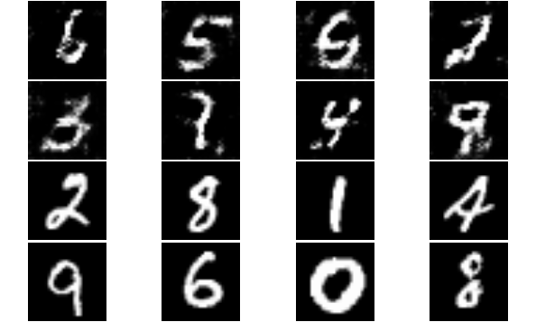

### Generator 

Network that build target objects (MNIST images) from 2 components: 
  - Noise vector  
  - The labels defining the object condition (which digit to produce)


```{r, include=FALSE}

require(imager)
require(dplyr)
require(DT)
require(mxnet)
```

```{r, echo=FALSE}

D_sym<- mx.symbol.load(file.name = "models/D_sym_model_A1.json")
G_sym<- mx.symbol.load(file.name = "models/G_sym_model_A1.json")

```


### Discriminator


### Training process

Starting from noise


Slowly getting it


Produce image on demand



